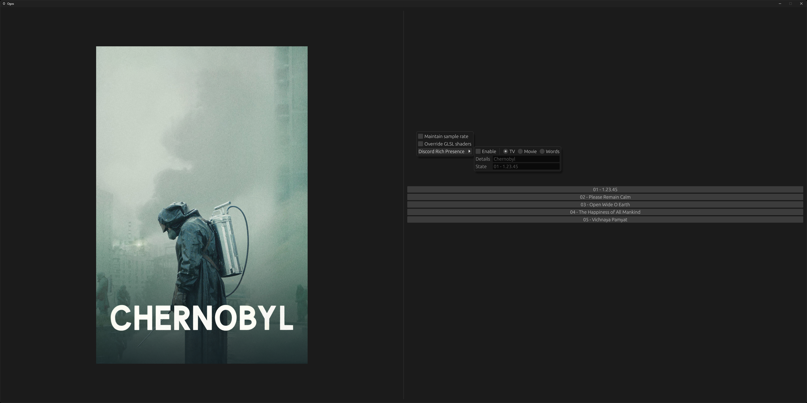

# Ogos

A media-focused helper and automation tool for Windows.

Run `ogos --help` for usage or refer to the [reference](./REFERENCE.md) for configuration.

# Features

- Audio:
    - Manage the default audio endpoint device and sample rate.
    - Manage active Equalizer APO configs.
- Binds:
    - Enable global hotkeys and dynamic key/button maps.
- Games:
    - Launch games and automate common tasks, such as switching display mode or changing desktop resolution.
- Media browser:
    - Collate files and folders into a unified view.
    - Integrate with [mpv](https://mpv.io/) and [ReShade](https://reshade.me/) to automate switching display mode, sample rate and tone mapping parameters.
    - Enable Discord Rich Presence when viewing media.
- Nvidia:
    - Configure color bit depth and dither state.
    - Clamp color space when switching display mode via a headless version of [novideo_srgb](https://github.com/bph1248/novideo_srgb).
- Taskbar:
    - Manage taskbar visibility by monitoring cursor collisions against an invisible window or 'hitbox'.
- Window shift:
    - Periodically 'pixel-shift' windows about the desktop in an effort to mitigate OLED burn-in.

# Screenshots

    
    
    

_Note: This project is in active development and breaking changes may occur at any time._
