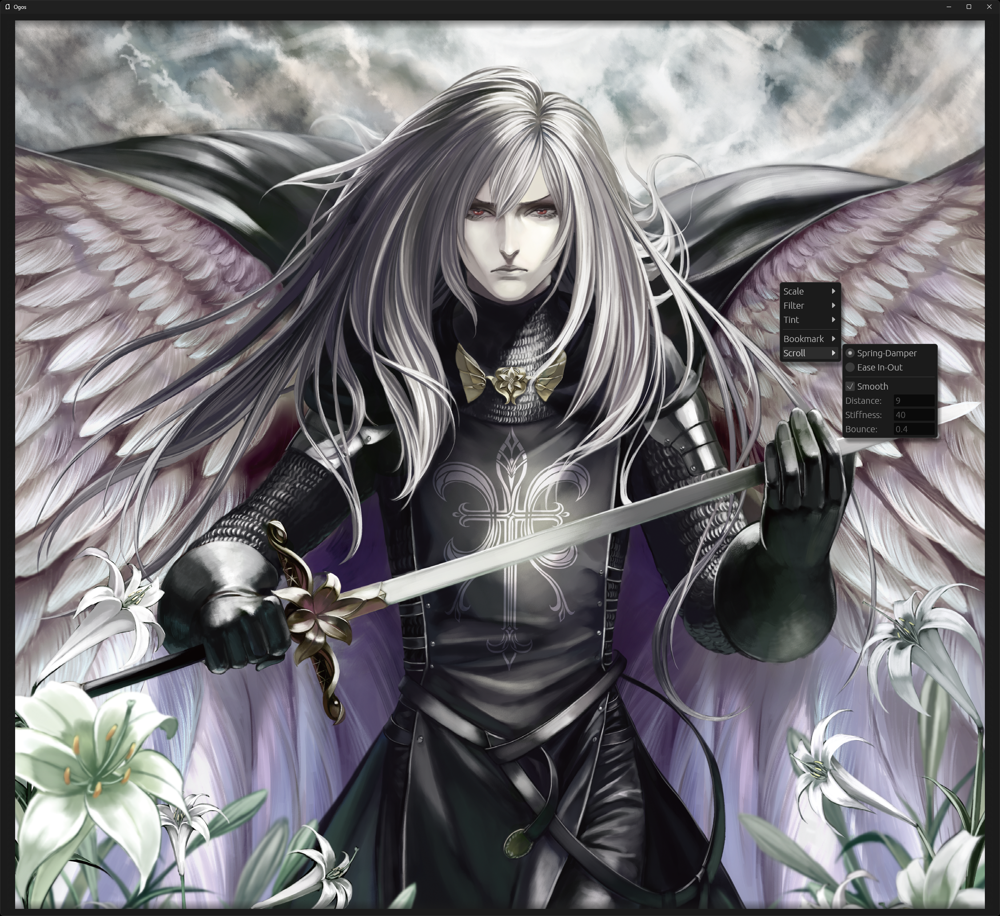

# Ogos

A media browser, manga reader and automation tool for Windows.

Run `ogos --help` for usage or refer to the [reference](./REFERENCE.md) for configuration.

# Features

- Audio:
    - Manage the default audio endpoint device and sample rate.
    - Manage active Equalizer APO configs.
- Binds:
    - Enable global hotkeys and dynamic key/button maps.
- Display:
    - Set brightness and enable pixel cleaning (Asus PG32UCDM).
    - Configure color bit depth and dither state (Nvidia).
- Games:
    - Automate common tasks when launching games, such as switching display mode or changing desktop resolution.
- Media browser / manga reader:
    - Collate files and folders into a unified view.
    - View JPEG/PNG/WebP-based .cbz files.
    - Configure spring/damper scroll physics.
    - Scale images with a selection of filters (Blackman, Lanczos, etc.).
    - Enable Discord Rich Presence.
    - Integrate with [mpv](https://mpv.io/) to automate switching display mode, sample rate and GLSL shaders when launching videos.
- Taskbar:
    - Manage taskbar visibility by monitoring cursor collisions against an invisible window or 'hitbox'.
- Window shift:
    - Periodically 'pixel-shift' desktop windows in an effort to mitigate OLED burn-in when viewing static content.

# Screenshots

    
      
    

_Note: This project is in active development and breaking changes may occur._
